# NovaCred Credit Application Governance Analysis


**Nova School of Business and Economics | MSc Business Analytics**

---

## Table of Contents

- [Repository Structure](#repository-structure)
- [Team Members](#team-members)
- [Executive Summary](#executive-summary)
- [Data Quality Assessment](#data-quality-assessment)
- [Bias Analysis Findings](#bias-analysis-findings)
- [Privacy and Governance Assessment](#privacy-and-governance-assessment)
- [Governance Recommendations](#governance-recommendations)

---

## Repository Structure

```text
project-team13/
├── README.md                           # Project overview & findings summary
├── data/                               # Data files
│   ├── raw_credit_applications.json    # Original dataset
│   └── clean_credit_applications.csv   # Post-quality remediation dataset
├── notebooks/                          # Analysis notebooks
│   ├── 01-data-quality.ipynb           # DQ audit and remediation
│   ├── 02-bias-analysis.ipynb          # Bias detection (Fairlearn)
│   └── 03-privacy-demo.ipynb           # Privacy mapping and auditing
├── src/                                # Reusable code
│   └── fairness_utils.ipynb            # Helper functions for bias analysis
└── reports/                            # Generated visuals and figures
```

---

## Team Members

| Name            | Role               |
| --------------- | ------------------ |
| Leonardo Baroni | Data Engineer      |
| Arslan Mubarak  | Data Scientist     |
| Paul            | Governance Officer |
| Caro            | Product Lead       |

---

## Executive Summary

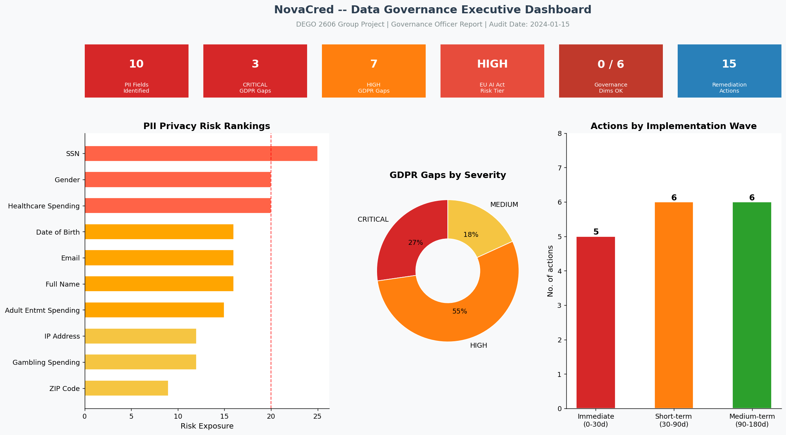

> This project audits the credit application dataset of **NovaCred**, a fictional
> fintech company under regulatory scrutiny for potential discrimination in lending.
> Acting as a Data Governance Task Force, our team analysed 500 credit applications
> for data quality issues, algorithmic bias, and GDPR/AI Act compliance gaps.
>
> **Key conclusion:** NovaCred's credit scoring system exhibits pervasive,
> multi-dimensional bias across all dimensions tested. The system must not be
> deployed without fundamental algorithmic review and independent auditing.

---

## Data Quality Assessment

Full analysis provided in `notebooks/01-data-quality.ipynb`.

### Completeness & Consistency

- Standardized Date of Birth formats across 161 records to ISO 8601.
- Mapped heterogeneous gender values (M/F/Male/Female/empty) to standard Male/Female/Unknown.
- Fixed mismatched JSON keys (`annual_salary` to `annual_income`) and coerced income columns to numeric format.
- Identified 896 missing critical fields (IP Address, SSN, Processing Timestamp, Loan Purpose) and set them to "unknown".

### Validity & Accuracy

- Handled negative values for `credit_history_months` (2) and `savings_balance` (1) by replacing them with median values.
- Remediated out-of-bounds metrics, such as `debt_to_income` exceeding 1.0.
- Detected and dropped 2 duplicate records out of the initial 502 total, leaving a clean dataset of 500 applications.

### Remediation Strategy

1. **Detect**: Track formatting, null rates, and logical validation constraints.
2. **Quantify**: Log counts or percentages of errors.
3. **Remediate**: Replace hard invalid cases with `NaN`, followed by median imputation for numerical data or "unknown" tagging for strings.

### Summary Table

| Dimension    | Issue Found                                      | Records Affected | Fix Strategy                             |
| ------------ | ------------------------------------------------ | :--------------: | ---------------------------------------- |
| Accuracy     | Duplicate IDs                                    |      4 -> 2      | Dropped duplicates using triage notes    |
| Consistency  | Gender coded as M/F/Male/Female/empty            |       113        | Mapped to Male/Female/Unknown            |
| Consistency  | Date of birth in 4 different formats             |       161        | Formatted to ISO 8601; derived age       |
| Validity     | Negative values / Invalid bounds (DTI > 1.0)     |        5         | Set to NaN -> applied median imputation  |
| Completeness | Missing PII & metrics (IP, SSN, Loan Purpose)    |    896 fields    | Nulls imputed with standard "unknown"    |
| Governance   | PII columns: Name, Email, SSN, IP, Date of Birth |       500        | Tagged for downstream Privacy processing |

---

## Bias Analysis Findings

Full analysis: `notebooks/02-bias-analysis.ipynb`

### Finding 1 - Gender Disparate Impact

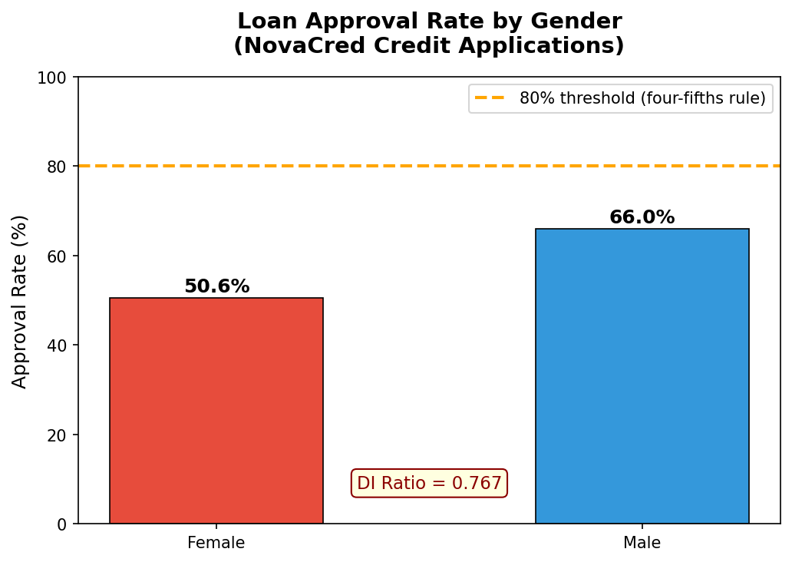

| Metric                | Value  |
| --------------------- | ------ |
| Female Approval Rate  | 50.6%  |
| Male Approval Rate    | 66.0%  |
| DI Ratio              | 0.7667 |
| Four-Fifths Threshold | 0.8    |
| Adverse Impact?       | YES    |

The DI ratio of 0.7667 falls below the recognised four-fifths rule threshold,
indicating female applicants face statistically significant disadvantage. Confirmed
independently by Fairlearn (DPR = 0.7667, DPD = 0.1539).

### Finding 2 - Age-Based Disparate Impact

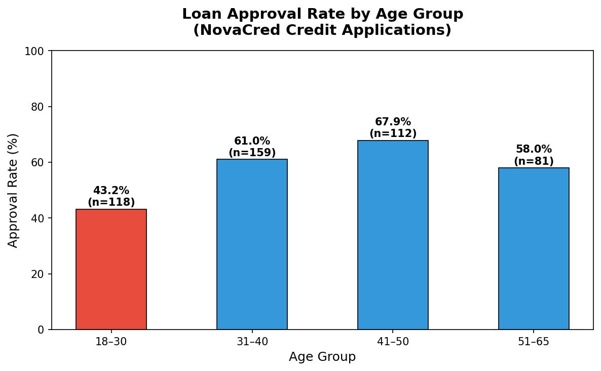

| Age Group | Approval Rate |
| --------- | ------------- |
| 18-30     | 43.2%         |
| 31-40     | 61.0%         |
| 41-50     | 67.9%         |
| 51-65     | 58.0%         |

Age DI Ratio: A value of 0.6369 shows it is more severe than gender bias. Young applicants (18-30)
are systematically penalised. Fairlearn DPD = 0.2464 confirms significant disparity.

### Finding 3 - ZIP Code Proxy Discrimination

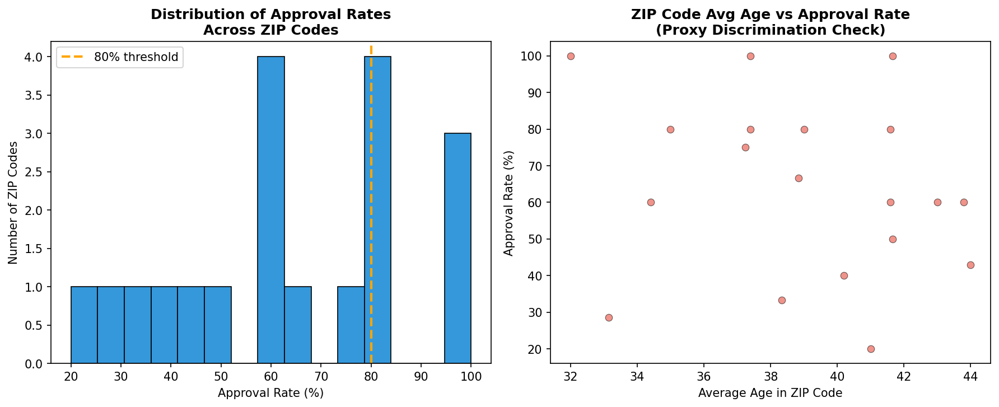

ZIP code shows a statistically significant correlation with loan outcomes
(r = -0.1259, p = 0.0048). ZIP codes with 100% female applicants have staggeringly low approval
rates while ZIP codes with 100% male applicants consistently achieve 100% approval.
ZIP code acts as a direct proxy for gender, meaning removing gender from the model
would not eliminate discriminatory outcomes.

### Finding 4 - Gender x Age Interaction Effects

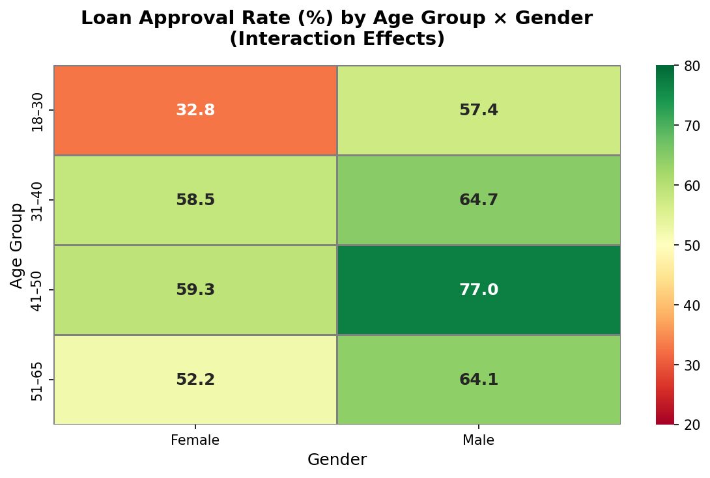

| Group                | Approval Rate |
| -------------------- | ------------- |
| Female 18-30         | 31.7%         |
| Male 41-50           | 76.3%         |
| Interaction DI Ratio | 0.4162        |

Young female applicants face compounded discrimination. Males outperform females
in every single age group without exception, ruling out coincidence and confirming
a structural gender penalty in the algorithm.

### Bias Summary Table

| Finding      | Metric   | Value  | Threshold | Status      |
| ------------ | -------- | ------ | --------- | ----------- |
| Gender DI    | DI Ratio | 0.7667 | >= 0.8    | FAIL        |
| Age DI       | DI Ratio | 0.6369 | >= 0.8    | FAIL        |
| ZIP Proxy    | p-value  | 0.0048 | > 0.05    | SIGNIFICANT |
| Gender x Age | DI Ratio | 0.4162 | >= 0.8    | SEVERE      |

---

## Privacy and Governance Assessment

### Executive Summary

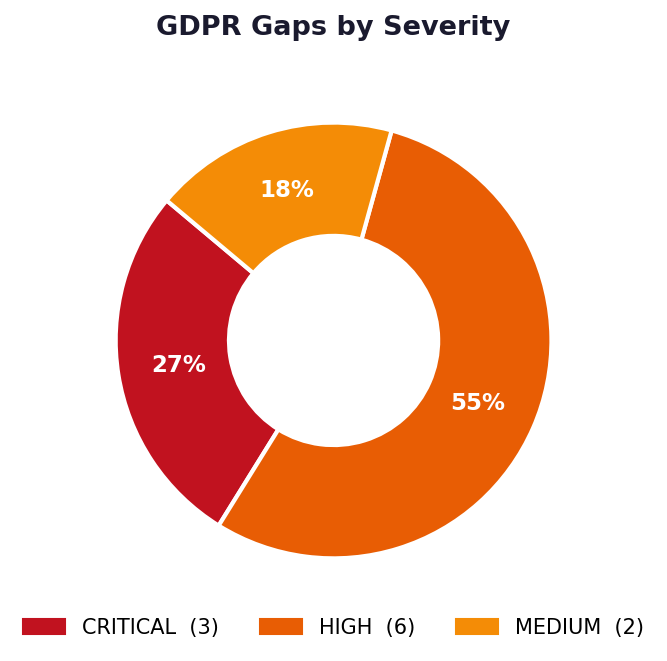

This assessment evaluates NovaCred's current state of readiness to handle personal data in compliance with GDPR. It focuses on measuring existing capabilities, identifying where controls are absent or inadequate, and quantifying the organization's exposure to regulatory and operational risk. This is a diagnostic document establishing the baseline against which progress will be measured.

The assessment found that NovaCred currently operates without foundational privacy infrastructure. Of the eleven identified compliance gaps, three are critical in nature and indicate processing practices that are directly prohibited under GDPR. The organization lacks documented governance structures, written policies, and technical controls necessary to demonstrate lawful processing.

**Overall Assessment:** Non-compliant across foundational dimensions. Immediate intervention required to prevent regulatory enforcement action.

---

## Assessment Scope and Methodology

This assessment was conducted between March 1-6, 2026 and examined:

- 500 credit application records across 34 data fields captured in clean_credit_applications.csv
- Technical storage and handling of personal data in current systems
- Organizational policies, procedures, and governance structures
- Staff awareness and training levels
- Subject rights request handling capabilities
- Vendor and processor management practices
- Documentation and audit trail capabilities

The assessment did not include system architecture review, security penetration testing, or breach response capability evaluation. Those are separate specialty assessments beyond the current scope.

Assessment methodology applied GDPR requirements as the authoritative standard, supplemented by European Data Protection Board guidelines, supervisory authority enforcement records, and industry best practices from comparable organizations.

---

## Part 1: Personal Data Inventory

### Data Collected and Stored

The dataset contains personal data across ten distinct categories:

**Direct Identifiers (500 records each):**

- Social Security Number: 500 records, plaintext storage
- Full Legal Name: 500 records, plaintext storage
- Email Address: 493 records, plaintext storage

**Quasi-Identifiers (99%+ coverage):**

- Date of Birth: 470 records (94%)
- IP Address: 500 records (100%)
- ZIP Code: 499 records (99.8%)

**Financial Data (100% coverage):**

- Annual Income: 500 records
- Credit History Months: 500 records
- Debt-to-Income Ratio: 500 records
- Savings Balance: 500 records
- Loan Amount Requested: 500 records

**Sensitive Spending Categories:**

- Healthcare Expenses: 68 records (13.6%)
- Gambling Expenses: 7 records (1.4%)
- Adult Entertainment Expenses: 5 records (1.0%)

**Protected Characteristics:**

- Gender: 500 records (100%)

### Data Retention Status

Current retention state:

- Records lacking timestamps: 438 of 500 (87.6%)
- Records with documented retention basis: 0
- Automated deletion processes: None
- Documented retention schedule: None
- Data subjects informed of retention period: No

### Data Access and Distribution

Current accessibility:

- Access to plaintext SSN: Data engineering, data science, analytics teams (estimated 15-20 personnel)
- Access logging: Not implemented
- Role-based access control: Not enforced
- Vendor access to raw data: Unknown (third-party relationships not documented)

---

## Part 2: Lawful Basis Assessment

### Current Processing Justification

Legal basis documentation review found:

- Written statement of lawful basis: None
- Consent from data subjects: None documented
- Processing agreements: Not confirmed with any vendors
- Legal review of basis selection: No evidence
- Alternative basis evaluation: Not documented

### Basis Assessment Against Article 6

| Potential Basis                | Applicable to Credit Scoring            | Evidence of Implementation  |
| ------------------------------ | --------------------------------------- | --------------------------- |
| Consent (6(1)(a))              | Unclear                                 | No consent mechanism exists |
| Contract (6(1)(b))             | Yes, if applicant initiates application | No documentation            |
| Legal Obligation (6(1)(c))     | Possible under financial regulation     | Not documented              |
| Vital Interests (6(1)(d))      | No                                      | Not applicable              |
| Public Task (6(1)(e))          | No                                      | Not applicable              |
| Legitimate Interests (6(1)(f)) | Possible with balancing test            | Not documented              |

**Finding:** No lawful basis has been formally identified, evaluated, or documented. Processing occurs without documented justification.

---

## Part 3: Special Category Data Assessment

### Special Category Data Identified

**Healthcare Spending (68 records):**

- Constitutes health data under Article 9(1)(h)
- Reveals medical conditions, medication use, hospital visits
- Processing prohibited under Article 9 without explicit legal basis
- No Article 9(2) basis applies to credit scoring use case
- Assessment: Unlawful processing

**Gambling Spending (7 records):**

- Infers addiction and health status
- No lawful basis under Article 9(2)
- Assessment: Unlawful processing

**Adult Entertainment Spending (5 records):**

- Infers sexual behaviour under Article 9(1)(a)
- No lawful basis under Article 9(2)
- Assessment: Unlawful processing

**Gender (500 records):**

- Protected characteristic under Article 9(1)(a)
- Used in credit scoring model
- Creates discrimination risk (Disparate Impact identified in notebook 02, DI < 0.8)
- No Article 9(2) basis justifies inclusion in scoring model
- Assessment: Unnecessary and creates discrimination risk

### Legal Basis Requirement

Article 9(2) provides ten grounds for lawful special category processing:

1. Explicit consent - Not obtained
2. Employment law - Not applicable
3. Vital interests - Not applicable
4. Non-profit organization - Not applicable
5. Publicly manifested data - Not applicable
6. Legal claims - Not applicable
7. Substantial public interest - Not applicable
8. Health or social care - Not applicable to credit scoring
9. Public health - Not applicable
10. Public interest - Not applicable

**Finding:** No lawful basis exists to process special category data for credit scoring purposes.

---

## Part 4: Technical Controls Assessment

### Current State of Data Protection

**Encryption:**

- Encryption at rest: Not implemented
- Encryption in transit: Verification not performed
- Key management: No key management system identified
- Backup encryption: Not documented
- Assessment: Absent

**Pseudonymisation:**

- Irreversible pseudonymisation: Not implemented
- Reversible pseudonymisation: Not implemented
- Salted hashing: Not implemented
- Any form of identifier obfuscation: Not implemented
- Assessment: Absent

**Access Control:**

- Role-based access control: Not enforced
- Principle of least privilege: Not documented
- Access logging: Not implemented
- Segregation of duties: Not implemented
- Assessment: Absent

**Data Quality:**

- Timestamp consistency: 438 of 500 records (87.6%) lack valid processing timestamps
- Data accuracy controls: Not documented
- Completeness validation: Not documented
- Assessment: Inadequate

### Security Controls Review

| Control                 | GDPR Requirement | Current Implementation | Assessment |
| ----------------------- | ---------------- | ---------------------- | ---------- |
| Encryption              | Article 32(1)(a) | Not implemented        | Absent     |
| Pseudonymisation        | Article 32(1)(a) | Not implemented        | Absent     |
| Access controls         | Article 32(1)(b) | Not documented         | Absent     |
| Availability/resilience | Article 32(1)(b) | Not evaluated          | Unknown    |
| Regular testing         | Article 32(1)(d) | Not performed          | Absent     |
| Incident response       | Article 33-34    | Not documented         | Absent     |
| Vendor security review  | Article 28       | Not performed          | Absent     |

**Finding:** No documented security controls exist to protect personal data.

---

## Part 5: Data Subject Rights Capability Assessment

### Right of Access (Article 15)

Current capability: Unknown

- Documented process for access requests: No
- Data export capability: No
- Response timeline tracking: No
- Estimated response time: Unknown

### Right to Erasure (Article 17)

Current capability: None

- Infrastructure for selective data deletion: No
- Automated erasure capability: No
- Contact mechanism for erasure requests: No
- Response timeline tracking: No
- Estimated capability: 0%

### Right to Rectification (Article 16)

Current capability: Unknown

- Documented process: No
- Data correction mechanism: No
- Notification of corrections: No

### Right to Restrict Processing (Article 18)

Current capability: None

- Ability to restrict future processing: No
- Documentation of restrictions: No
- Estimated capability: 0%

### Right to Portability (Article 20)

Current capability: None

- Machine-readable export format: No
- Structured data provision: No
- Estimated capability: 0%

### Right to Object (Article 21)

Current capability: Unknown

- Documented objection process: No
- Automated decision opt-out: No
- Estimated capability: 0%

### Rights Related to Automated Decision-Making (Article 22)

Current capability: None

- Notification of automated decision-making: No
- Right to explanation: Not implemented
- Right to human review: No process
- Right to contest: No mechanism
- Estimated capability: 0%

**Overall Finding:** NovaCred has no documented or implemented capability to respond to the majority of data subject rights requests. The organization cannot demonstrate compliance with Articles 15-22.

---

## Part 6: Automated Decision-Making Assessment

### Current Decision-Making Process

Credit scoring system:

- Model type: Proprietary risk algorithm
- Decision type: Fully automated (no human review)
- Rejection decisions: 169 of 500 applicants (33.8%)
- Decision notification: Risk score only, no explanation

### Article 22 Compliance Evaluation

**Right to Explanation:**

- Model logic documented for applicants: No
- Feature importance communicated: No
- Decision factors identified: No
- Explanation template: None
- Current notification: "algorithm_risk_score" (numeric value only)

**Right to Human Review:**

- Appeal process documented: No
- Human review available: No
- Review decision criteria: Not defined
- Estimated timeline for review: Unknown
- Current process: None

**Right to Contest:**

- Mechanism for contestation: None
- Contact point for disputes: Not documented
- Response timeline: Not defined
- Escalation path: Unknown

**Data Subject Notification:**

- Informed that automated decision-making exists: No
- Informed of significance of decision: No
- Informed of envisaged consequences: No
- Privacy notice disclosures: Not made

**Finding:** Automated credit decisions are made and communicated to applicants without any of the Article 22 safeguards. Applicants receive no notification that decisions are automated, no explanation of decision logic, and no mechanism to contest or request human review.

---

## Part 7: Organizational Governance Assessment

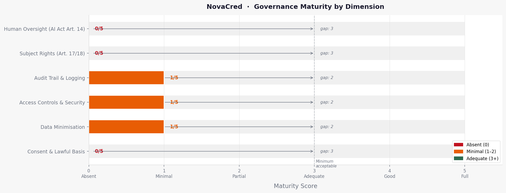

### Governance Structure

Current state:

- Data Protection Officer designated: Not confirmed
- Data Governance Committee: Does not exist
- Privacy function: Not formally established
- Policy committee: Does not exist
- Escalation authority for privacy issues: Not defined

### Policy Documentation

Current state:

- Comprehensive privacy policy: None
- Data handling standard: None
- Retention policy: None
- Access control policy: None
- Incident response plan: None
- Data Processing Agreement template: None
- Records of Processing Activities: None

### Staff Training and Awareness

Current state:

- GDPR training completion rate: Unknown
- Privacy awareness program: Not established
- Data handling training: Not conducted
- Staff certification on privacy practices: None
- Accountability assignment: Not documented

### Vendor Management

Current state:

- List of data processors: Unknown
- Data Processing Agreements executed: Unknown
- Processor security assessments: Not conducted
- Sub-processor authorization: Not documented
- Contractual obligations for data protection: Unknown

---

## Part 8: Regulatory Risk Assessment

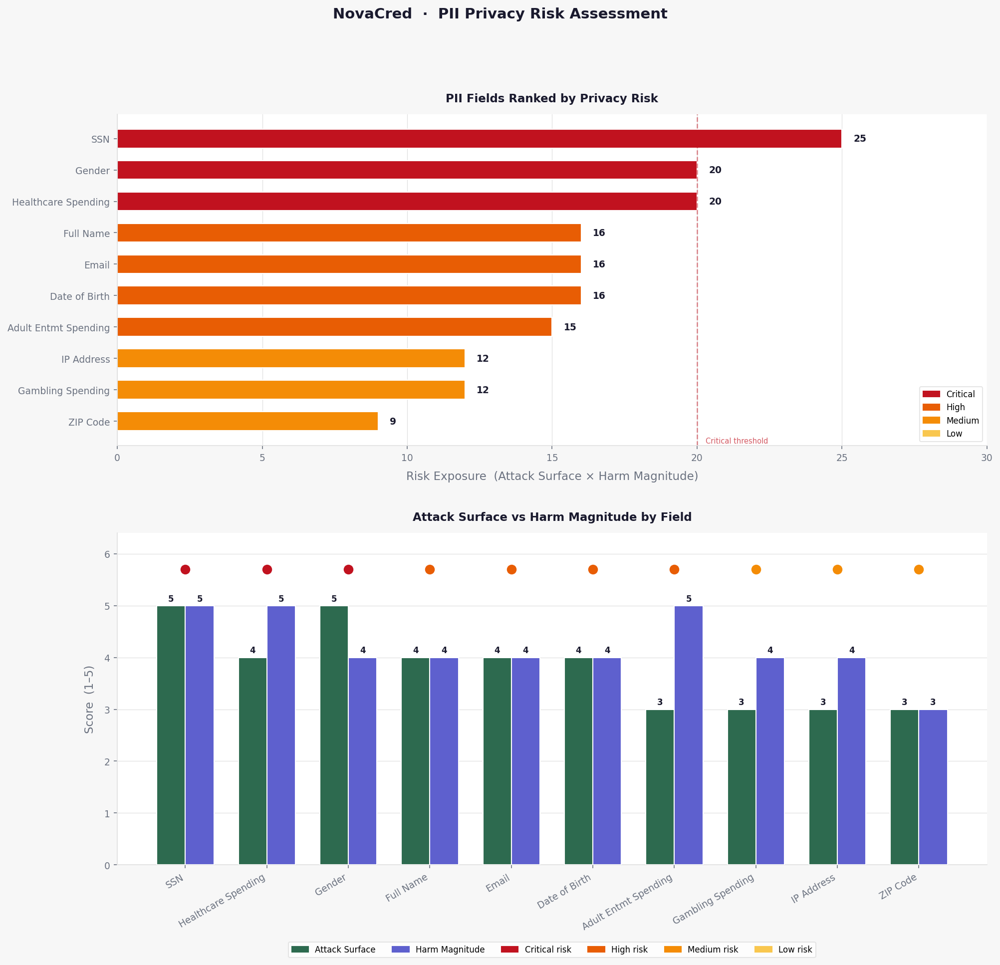

### Violation Categories Identified

**Category 1: Violation of Processing Principles**

- Lawfulness requirement (Article 6): Processing without documented basis
- Fairness requirement (Article 5(1)(a)): No transparency measures
- Accuracy requirement (Article 5(1)(d)): No data quality controls
- Storage limitation (Article 5(1)(e)): Indefinite retention

**Category 2: Violation of Special Category Protections**

- Article 9 violations: Processing healthcare, gambling, entertainment spending without basis
- Article 9 violations: Processing gender in discriminatory manner (DI < 0.8)

**Category 3: Violation of Data Protection Rights**

- Article 15 (access): No mechanism to respond
- Article 17 (erasure): No infrastructure
- Article 22 (automated decisions): No safeguards or explanations
- Article 13 (transparency): No privacy notice

**Category 4: Violation of Technical Requirements**

- Article 25 (privacy by design): No design controls
- Article 32 (security): No encryption, no access controls, no pseudonymisation

### Enforcement Likelihood

**High Likelihood Scenarios:**

- Data breach affecting any of the 500 applicants: Supervisory authority investigation probable
- Data subject complaint related to rejection decision or unauthorized processing: Regulatory response expected
- Audit or inspection by competent authority: Violations would be identified immediately

**Penalty Exposure:**

Under Article 83 GDPR:

- Tier 1 violations (up to EUR 10,000,000 or 2% global turnover): Processing without basis, failure to implement security, failure to handle data subject rights
- Tier 2 violations (up to EUR 20,000,000 or 4% global turnover): Special category processing without basis, automated decisions without safeguards

**Risk Level:** Critical

---

## Part 9: Data Quality and Integrity Assessment

### Completeness

Field coverage analysis:

- 100% complete fields: SSN, Full Name, IP Address, Gender, Financial data (8 fields)
- 94-99% complete fields: Email (98.6%), DOB (94%), ZIP Code (99.8%)
- Low coverage fields: Healthcare (13.6%), Gambling (1.4%), Adult Entertainment (1%)

**Finding:** High coverage of direct identifiers with no documented justification for collection precision level.

### Accuracy

Validation checks performed: None documented
Data quality rules enforced: Not identified
Duplicate detection: Performed (notebook 01), but mechanism and frequency unknown
Invalid format detection: Applied in notebook 01, residual invalid records: Unknown

**Finding:** Data quality process exists upstream (notebook 01) but current system state unknown.

### Consistency

Timestamp consistency: 438 records (87.6%) lack valid timestamps
Field definition consistency: Not evaluated
Cross-system consistency: Unknown (integration with other systems not documented)

**Finding:** Significant data quality issues prevent reliable audit and compliance verification.

---

## Part 10: Comparative Risk Analysis

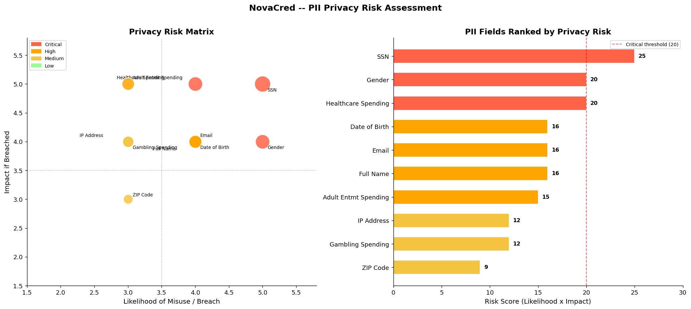

### Dataset Sensitivity Profile

Compared to industry baselines:

Healthcare and financial services organizations typically:

- Encrypt 95-100% of PII at rest
- Pseudonymise direct identifiers in analytics
- Maintain audit logs of data access
- Implement role-based access controls
- Provide privacy notices at point of collection
- Respond to data subject requests within 14 days
- Conduct annual DPIA for high-risk processing

NovaCred current state:

- Encryption: 0%
- Pseudonymisation: 0%
- Audit logging: 0%
- Access controls: 0%
- Privacy notice: 0%
- Data subject response capability: 0%
- DPIA: Not conducted

**Assessment:** Substantially below industry baseline across all dimensions.

### Regulatory Expectation Gap

Based on supervisory authority enforcement actions and guidance documents:

Expected baseline for credit decision systems:

- Documented lawful basis and transparency notices
- Elimination of unlawful special category processing
- Explanation and human review for automated rejections
- Data retention policies with automated deletion
- Pseudonymisation of direct identifiers
- Access controls and audit logging

NovaCred gap: 100% (no baseline controls present)

---

## Part 11: Assessment Summary by Gap Category

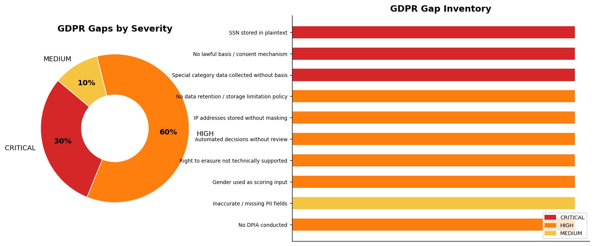
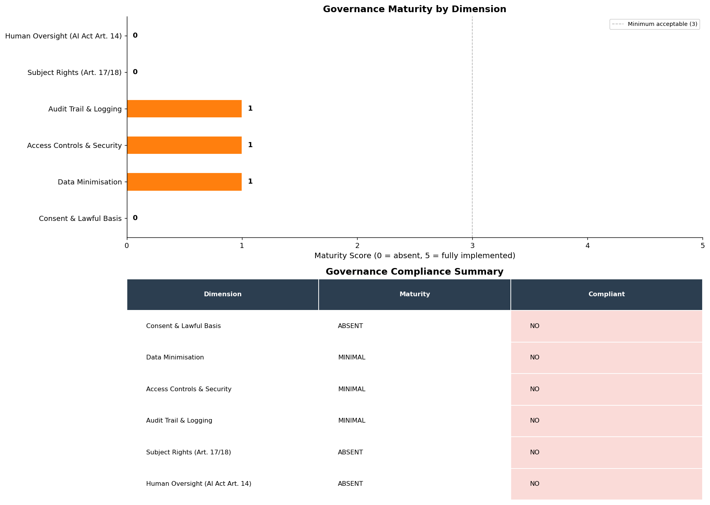

### Critical Findings (3)

1. **Plaintext Storage of SSN (500 records)**
   - Regulatory severity: Very High
   - Operational impact: System redesign required
   - Timeline to remediation: 30-60 days
   - Estimated cost: Moderate

2. **Processing Special Category Data Without Basis (80 records)**
   - Regulatory severity: Very High
   - Operational impact: Collection cessation required
   - Timeline to remediation: Immediate (0-30 days)
   - Estimated cost: Low (removal only)

3. **Automated Decisions Without Explanation or Human Review (169 rejections)**
   - Regulatory severity: Very High
   - Operational impact: Decision process redesign required
   - Timeline to remediation: 60-90 days
   - Estimated cost: Moderate to High

### High-Priority Findings (6)

4. No lawful basis documentation (500 records)
5. No privacy notice at point of collection (500 records)
6. No data retention or deletion policy (500 records)
7. IP addresses stored unmasked (500 records)
8. No right to erasure infrastructure
9. No DPIA conducted

### Medium-Priority Findings (2)

10. Quasi-identifier combination not addressed (ZIP+DOB+Gender)
11. No Records of Processing Activities maintained

---

## Assessment Limitations and Caveats

This assessment examined:

- Personal data inventory and classification
- Legal basis and transparency requirements
- Technical controls for data protection
- Data subject rights capabilities
- Organizational governance structures

This assessment did NOT examine:

- Information security beyond privacy requirements (e.g., DDoS protection)
- Business continuity and disaster recovery (beyond data recovery for erasure)
- Incident response plan testing
- Third-party processor security in depth
- Employee background checks and vetting procedures
- Physical security of data centers

A comprehensive privacy audit would require deeper evaluation of security infrastructure, incident response readiness, and comprehensive vendor assessments. This assessment focuses on foundational GDPR compliance gaps.

---

## Conclusion

NovaCred currently lacks the foundational infrastructure, documentation, and controls necessary to demonstrate GDPR compliance. The organization operates personal data at scale (500 records across 34 fields) without documented lawful basis, without technical protections, and without the ability to respond to data subject rights requests.

The eleven identified gaps span critical violations of core GDPR principles (lawfulness, fairness, data minimisation, storage limitation, integrity/confidentiality), special category protections, technical security requirements, and data subject rights provisions.

However, the gaps identified in this assessment are remediable through operational and technical controls. The organization possesses the necessary foundational infrastructure (database systems, application frameworks) to implement the required protections. Success requires executive commitment, allocation of adequate resources, and systematic remediation following the prioritization outlined in the accompanying Governance Recommendations document.

The assessment establishes the baseline against which progress will be measured. A follow-up assessment in 180 days should verify that critical gaps have been closed and that high-priority remediation is on schedule.

---

**Document Information:**

- Assessment completion date: March 6, 2026
- Prepared by: Paul Specht and Carolina Painvin, GDPR Officers
- Classification: Internal - Legal Privilege
- Distribution: Executive Leadership, Legal/Privacy, Board Audit Committee
- Confidentiality: This assessment contains sensitive legal analysis and should not be disclosed outside the organization without legal counsel review

---

## Governance Recommendationsa

# Governance Recommendations

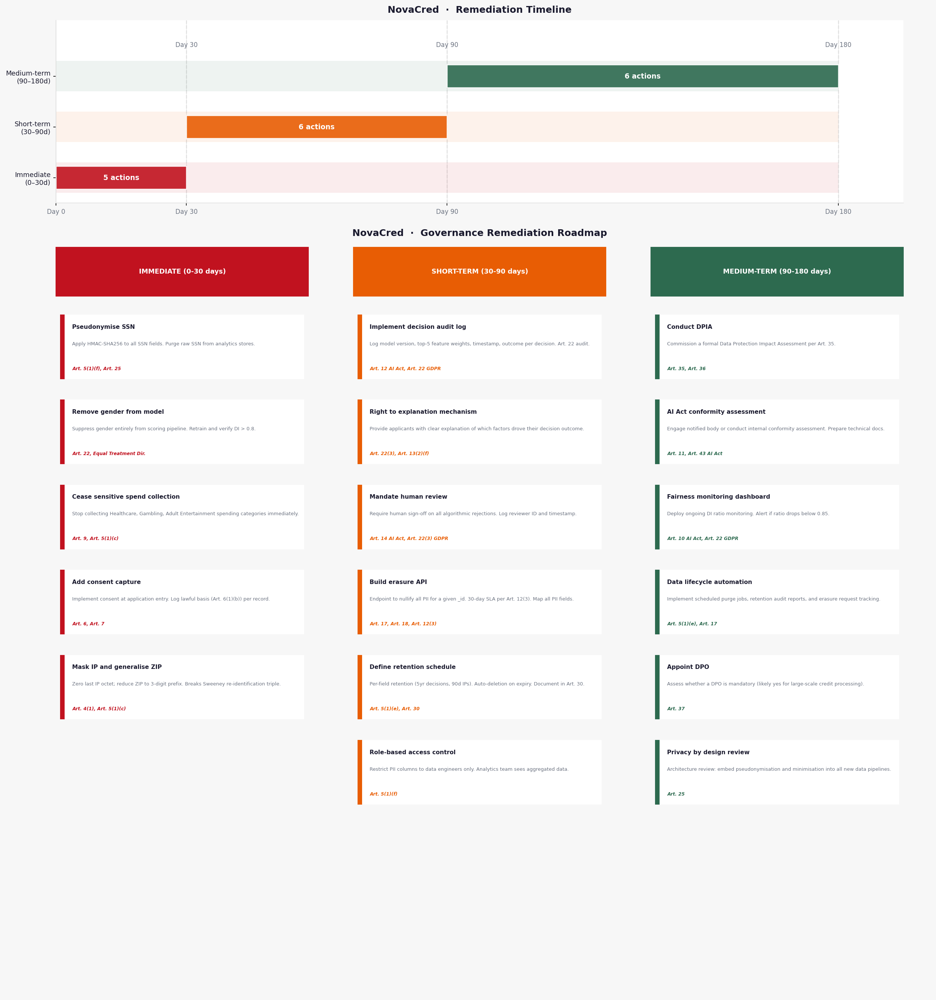

## Overview

This section synthesizes findings from the Privacy and Data Governance audit (notebook 03) into a structured set of governance improvements. Recommendations are prioritized by legal urgency, operational feasibility, and risk impact.

## Priority 1: Immediate Actions (0-30 Days)

### 1.1 Cease Collection of Special Category Data

**Current State:** Healthcare spending (68 records), Gambling spending (7 records), and Adult Entertainment spending (5 records) are collected without documented legal basis.

**Legal Obligation:** Article 9 GDPR prohibits processing of special category data except under narrow grounds. Health data inferred from spending patterns and sexual behaviour inferred from entertainment spending constitute special categories and cannot be processed without explicit legal basis.

**Action Items:**

- Remove healthcare, gambling, and adult entertainment spend fields from the application form immediately
- Issue data handling notice to all staff instructing cessation of collection
- Audit existing databases to tag records containing these fields as restricted pending deletion
- Document the decision and date of cessation for regulatory records

**Responsible Party:** Data Governance Team, supported by Legal Compliance

**Success Metrics:** Zero new records collected with these fields; historical data flagged and scheduled for deletion per retention policy

---

### 1.2 Implement Privacy Notice at Application Intake

**Current State:** Applicants are not informed of data collection, processing purposes, automated decision-making, or their rights.

**Legal Obligation:** Article 13 GDPR requires provision of specific information at the point of collection, including processing purposes, legal basis, recipient categories, retention period, and rights (access, erasure, portability, objection, right to explanation for automated decisions).

**Action Items:**

- Draft privacy notice addressing all Article 13 requirements
- Include clear disclosure of automated credit scoring decision-making
- Explain right to human review of automated rejections
- Provide contact information for data subject rights requests
- Obtain legal review before implementation
- Deploy notice on application form and website
- Maintain records of when notice was presented to each applicant

**Responsible Party:** Legal Compliance, Data Governance, Communications

**Success Metrics:** Privacy notice implemented on 100% of new applications; audit trail captures notice presentation timestamp per applicant

---

### 1.3 Implement SSN and Email Pseudonymisation at Ingestion

**Current State:** All 500 records contain plaintext SSN and 493 contain plaintext email addresses with no pseudonymisation or encryption.

**Legal Obligation:** Article 5(1)(f) requires integrity and confidentiality of personal data. Article 25 requires privacy by design. Article 32 mandates appropriate technical security measures. Storing SSN in plaintext violates all three.

**Action Items:**

- Configure data ingestion pipeline to apply HMAC-SHA256 pseudonymisation to SSN field
- Apply same pseudonymisation to email field
- Store the HMAC secret key in AWS KMS (or equivalent dedicated key management system)
- Restrict key access via IAM policies to data engineering and security teams only
- Document the pseudonymisation procedure and key management controls
- Update application database schema to replace ssn column with ssn_pseudonym
- Implement audit logging of any access to the key

**Responsible Party:** Data Engineering, Security Engineering

**Success Metrics:** 100% of new records ingested with pseudonymised SSN and email; no plaintext SSN values accessible to analytics teams; key access logs reviewed weekly

**Technical Note:** HMAC-SHA256 provides deterministic pseudonymisation (same applicant gets same token) preserving deduplication capability. The secret key must never be committed to version control or logged.

---

## Priority 2: Short-Term Actions (30-90 Days)

### 2.1 Add Consent and Legal Basis Collection to Application Form

**Current State:** No field in the application captures applicant consent or documents the legal basis for processing.

**Legal Obligation:** Article 6 requires a lawful basis for processing. Article 7 specifies conditions for consent-based processing. Article 30 requires the controller to maintain records of processing activities including the legal basis.

**Action Items:**

- Identify primary lawful basis: Article 6(1)(b) (performance of contract) is appropriate for credit decision processing
- Add checkbox to application: "I consent to NovaCred processing my personal data for credit assessment purposes in accordance with the privacy notice"
- Maintain separate processing_basis field in database recording the basis for each applicant
- Document basis selection in Records of Processing Activities per Article 30
- Implement logic to prevent application processing without explicit consent checkbox
- Maintain audit trail of when consent was obtained

**Responsible Party:** Legal Compliance, Product, Data Governance

**Success Metrics:** 100% of new applications contain consent documentation; processing_basis field populated for all records; audit trail maintained

---

### 2.2 Implement IP Address Masking

**Current State:** All 500 records contain full IPv4 addresses unmasked.

**Legal Obligation:** ECJ Breyer Decision (C-582/14) established that dynamic IP addresses are personal data under Article 4(1). Article 5(1)(c) mandates data minimisation. Storing full IP addresses exceeds the level of precision required for most operations.

**Action Items:**

- Configure application to mask final octet of all IPv4 addresses at ingestion
- Restrict access to unmasked IP addresses to fraud detection team only
- Implement 90-day retention limit for unmasked IPs in fraud detection logs
- Apply masking retroactively to historical records in production database
- Document masking procedure in Data Handling Standard

**Responsible Party:** Data Engineering, Information Security, Fraud Team

**Success Metrics:** 100% of new records contain masked IP; unmasked IP access restricted to fraud team; 90-day deletion implemented

---

### 2.3 Establish Records of Processing Activities

**Current State:** No formal Records of Processing Activities (ROPA) document exists per Article 30.

**Legal Obligation:** Article 30 GDPR requires controllers to maintain comprehensive records of all processing activities, including purposes, categories of data, recipients, retention periods, and security measures.

**Action Items:**

- Document all data collection points: application form, third-party data enrichment, payment processing, fraud detection systems
- For each processing activity, record: purpose, data categories, recipient categories, retention schedule, security controls, legal basis
- Include fields for DPA status (Data Protection Impact Assessment)
- Maintain version history and update dates
- Make ROPA available for inspection by supervisory authorities
- Assign ownership to Data Governance function

**Responsible Party:** Data Governance, supported by all data-handling teams

**Success Metrics:** ROPA document complete and signed off; accessible to supervisory authorities within 30 days of request; updated quarterly

---

### 2.4 Build Subject Rights API for Erasure Requests

**Current State:** Current flat-file architecture makes selective PII deletion technically impossible. No process exists for handling right to erasure (Article 17) requests.

**Legal Obligation:** Article 17 grants data subjects the right to erasure in specified circumstances. Article 12(3) requires the controller to act on such requests without undue delay and within one month.

**Action Items:**

- Design API endpoint: /api/v1/subjects/{applicant_id}/erase
- API must securely authenticate the data subject and verify the erasure basis
- Erase all PII fields: full_name, email, ssn_pseudonym, ip_masked, date_of_birth, zip_region, gender
- Retain anonymised fields for regulatory audit: credit decision, decision date, decision reasoning
- Implement audit trail logging all erasure operations (timestamp, requester, data subject ID, reason)
- Establish process for handling erasure requests submitted via privacy@novacred.com
- Set target response time: 14 days (within 30-day legal maximum)
- Test erasure functionality with real data subject requests

**Responsible Party:** Data Engineering, Security, Privacy/Legal

**Success Metrics:** API live and tested; erasure requests resolved within 14 days; zero compliance breaches on response timelines

---

### 2.5 Implement Data Retention and Deletion Policy

**Current State:** No retention schedule exists. 438 of 500 records lack valid processing timestamps. No automated deletion mechanism is in place.

**Legal Obligation:** Article 5(1)(e) requires storage limitation: personal data kept no longer than necessary. Article 13(2)(a) requires informing data subjects of retention periods.

**Action Items:**

- Define retention schedules per data category:
  - Credit decision records: 5 years (standard financial dispute limitation period)
  - Application form PII (name, email, SSN): 90 days post-decision (appeals period)
  - IP addresses: 90 days maximum (fraud prevention only)
  - Pseudonymised data for analytics: 2 years
  - Special category data: Delete immediately upon decision
- Implement ISO 8601 timestamp capture on all records
- Build automated deletion scheduled jobs running nightly
- Create audit trail of deleted records (without exposing PII values)
- Update privacy notice to specify retention periods
- Report deletion metrics monthly to Data Governance

**Responsible Party:** Data Engineering, Data Governance

**Success Metrics:** Retention policy documented and approved; deletion automation live; monthly deletion reports submitted; zero expired data remaining in systems

---

## Priority 3: Medium-Term Actions (90-180 Days)

### 3.1 Conduct Data Protection Impact Assessment

**Current State:** No DPIA has been conducted despite processing high-risk data in automated decision-making context.

**Legal Obligation:** Article 35 mandates DPIA for processing likely to result in high risk to rights and freedoms. Credit scoring systems processing special category data or making automated decisions are explicitly listed in guidance as requiring DPIA. Article 36 requires consultation with supervisory authority if residual risk remains high.

**Action Items:**

- Identify DPIA scope: the complete credit decision processing pipeline
- Document data flows from application intake through decision notification
- Identify processing risks: re-identification through quasi-identifiers, automated decision bias, special category data exposure, data breach impact
- Assess mitigating controls: pseudonymisation, retention policies, explainability, human review
- Determine residual risk level
- If high risk remains, prepare consultation request to supervisory authority per Article 36
- Document DPIA in writing and maintain for regulatory inspection
- Update DPIA annually as systems evolve

**Responsible Party:** Data Governance, Privacy/Legal, Data Engineering, Business Units

**Success Metrics:** DPIA completed and documented; residual risks addressed; if required, supervisory authority consultation completed

---

### 3.2 Implement Decision Explanation and Human Review Process

**Current State:** 169 rejections cite only "algorithm_risk_score" with no explanation. No human review occurs. Applicants are unaware automated decision-making is occurring.

**Legal Obligation:** Article 22 GDPR grants rights related to automated decision-making: right to explanation of logic (Article 22(3)), right to human review, right to contest. Articles 13(2)(f) and 14(2)(g) require transparency disclosures about automated decision-making.

**Action Items:**

- Implement explainability layer identifying top three contributing factors to credit score
- Generate decision letter template including: decision outcome, explanation of key factors, applicant's data used, right to contest, instructions for requesting human review
- Send decision letters to all applicants (approved and rejected)
- Establish human review process: applicants can request review within 30 days of rejection
- Train credit officers to conduct human reviews considering applicant context beyond algorithm output
- Maintain human review decision logs (applicant ID, original decision, human decision, reasoning)
- Report monthly metrics: rejection rate, human review request rate, human override rate
- Include explanation and human review rights in privacy notice

**Responsible Party:** Product, Data Science, Credit Operations, Privacy/Legal

**Success Metrics:** 100% of applicants receive decision explanation; human review process operational; response time under 14 days; audit trail maintained

---

### 3.3 Establish Governance Structure and Data Protection Officer Role

**Current State:** Governance responsibilities are unclear; no formal Data Protection Officer function exists.

**Legal Obligation:** Article 37 recommends (and in some sectors mandates) designation of a Data Protection Officer. Article 5(2) requires demonstrable accountability through governance structures.

**Action Items:**

- Designate or hire Data Protection Officer if not already appointed
- Create Data Governance Committee with representation from Legal, Privacy, Data Engineering, Security, Business Units
- Establish monthly governance review cadence
- Define clear data handling policies: access controls, acceptable use, incident response
- Assign data ownership across all systems (business unit owns the data and is responsible for compliance)
- Create Data Handling Standard documenting pseudonymisation, encryption, retention, deletion procedures
- Maintain centralized policy register accessible to all staff
- Conduct annual governance audit

**Responsible Party:** Executive Leadership, Data Governance

**Success Metrics:** DPO designated; Governance Committee meeting monthly; policies documented and approved; staff trained

---

### 3.4 Implement Encryption for Data at Rest and in Transit

**Current State:** No documented encryption for data at rest. Data transit encryption status unclear.

**Legal Obligation:** Article 32 mandates encryption as state-of-the-art security measure. Article 5(1)(f) requires integrity and confidentiality.

**Action Items:**

- Implement AES-256 encryption for all databases containing personal data
- Enable TLS 1.2+ for all data in transit
- Manage encryption keys in AWS KMS or equivalent
- Implement backup encryption with separate key management
- Document encryption procedures in Security Standard
- Conduct annual encryption audit
- Test decryption procedures quarterly

**Responsible Party:** Information Security, Data Engineering

**Success Metrics:** Encryption implemented and audited; zero plaintext PII in storage; TLS 1.2+ on 100% of API endpoints

---

## Priority 4: Long-Term Actions (180+ Days)

### 4.1 Complete Data Processing Agreements with All Processors

**Current State:** No documentation of whether third-party data processors (e.g., analytics platforms, payment processors, fraud detection vendors) have signed Data Processing Agreements (DPA).

**Legal Obligation:** Article 28 requires a Data Processing Agreement between controller and any processor. The DPA must specify processing instructions, security obligations, and data subject rights procedures.

**Action Items:**

- Inventory all third-party vendors processing personal data
- Obtain or negotiate Data Processing Agreements with each vendor
- Ensure DPA covers: processing scope, security standards (Article 32), subprocessor management, data subject rights support, audit rights
- Maintain executed DPA copies in centralized register
- Update DPAs when vendor security practices change
- Conduct annual vendor security review

**Responsible Party:** Procurement, Privacy/Legal, Data Governance

**Success Metrics:** DPA executed with 100% of personal data processors; register maintained and reviewed annually

---

### 4.2 Implement Privacy by Design in All New Systems

**Current State:** Existing systems were not designed with privacy as a primary requirement.

**Legal Obligation:** Article 25 requires privacy by design and privacy by default in all processing activities.

**Action Items:**

- Establish Privacy by Design guidelines for system development
- Require DPIA for all new data processing activities before implementation
- Build pseudonymisation and access controls into system architecture
- Implement data minimisation from the design phase
- Establish privacy review in development lifecycle (design, build, test, deploy phases)
- Train engineering and product teams on privacy principles
- Require privacy sign-off before production deployment

**Responsible Party:** Data Governance, Security, Engineering Leadership

**Success Metrics:** Privacy by Design guidelines documented; DPIA required for 100% of new processing; zero privacy-related production incidents

---

### 4.3 Conduct Annual Compliance Audits

**Current State:** No formal audit schedule exists.

**Legal Obligation:** Article 5(2) requires accountability demonstrated through regular compliance monitoring.

**Action Items:**

- Schedule annual third-party compliance audit covering GDPR and Data Protection Act requirements
- Audit scope: data flows, security controls, retention policies, subject rights processes, vendor management
- Review findings and remediate identified gaps
- Report audit results to board/executive leadership
- Maintain audit documentation for regulatory inspection
- Conduct internal compliance reviews quarterly

**Responsible Party:** Data Governance, supported by Internal Audit function

**Success Metrics:** Annual audit completed; findings tracked and remediated; audit report submitted to leadership

---

## Governance Metrics and Monitoring

### Key Performance Indicators

Data Quality:

- Percentage of records with valid processing timestamps: target 100%
- Percentage of records with documented consent/basis: target 100%
- Percentage of special category data suppressed: target 100%

Privacy Protection:

- Percentage of personal data pseudonymised: target 100%
- Percentage of IP addresses masked: target 100%
- Percentage of plaintext sensitive fields: target 0%

Subject Rights:

- Average response time to access requests: target under 14 days
- Average response time to erasure requests: target under 14 days
- Erasure request success rate: target 100%
- Human review request response time: target under 14 days

Vendor Management:

- Percentage of processors with executed DPA: target 100%
- Annual security review completion rate: target 100%

Compliance:

- Data retention policy compliance: target 100%
- DPIA completion rate for new processing activities: target 100%
- Staff training completion rate: target 100% annually

### Monitoring and Reporting Cadence

Weekly: Review deletion automation logs, assess data quality metrics

Monthly: Data Governance Committee review, subject rights request processing report, vendor security status

Quarterly: Internal compliance review, staff training updates, privacy policy updates as needed

Annually: Third-party audit, supervisory authority consultation (if required), strategic privacy roadmap review

---

## Governance Accountability Matrix

| Function             | Responsibility                                                                              | Accountability                             |
| -------------------- | ------------------------------------------------------------------------------------------- | ------------------------------------------ |
| Legal/Privacy        | Develop policies, interpret GDPR, handle supervisory authority communications               | Chief Legal Officer                        |
| Data Governance      | Maintain ROPA, oversee DPIA, monitor compliance metrics, manage retention policies          | Chief Data Officer                         |
| Data Engineering     | Implement pseudonymisation, encryption, deletion automation, erasure API                    | VP Engineering                             |
| Information Security | Manage encryption keys, audit security controls, manage vendor security reviews             | Chief Security Officer                     |
| Compliance/Audit     | Conduct internal and third-party audits, report findings to board                           | Chief Compliance Officer / Audit Committee |
| Business Units       | Own data, complete privacy training, support subject rights requests, report data incidents | Individual business leaders                |

---

## Conclusion

The governance recommendations outlined above address eleven identified compliance gaps across critical, high-priority, and medium-priority areas. Implementation across all priority levels will establish NovaCred as a privacy-compliant organization capable of demonstrating accountability under Article 5(2).

The phased approach allows for immediate risk mitigation while building sustainable long-term governance infrastructure. Success requires sustained commitment from executive leadership, coordination across technical and business teams, and regular monitoring against defined metrics.

All recommendations are aligned with specific GDPR articles and supported by technical and operational implementation details. Progress should be reviewed monthly by the Data Governance Committee with quarterly reporting to executive leadership.
